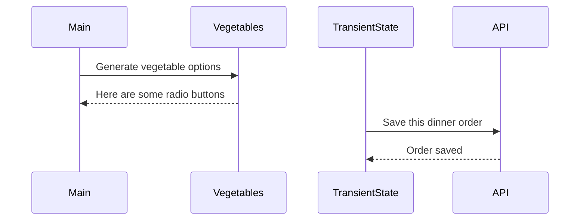

# Events and State Self-Assessment

> 🧨 Make sure you answer the vocabulary and understanding questions at the end of this document before notifying your coaches that you are done with the project

## Setup

1. Make sure you are in your `workspace` directory
1. `git clone {github repo SSH string}`
1. `cd` into the directory it creates
1. `code .` to open the project code
1. Use the `serve` command to start the web server
1. Open the URL provided in Chrome

## Requirementse

### Initial Render

1. All 10 base dishes should be displayed as radio input options.
1. All 9 vegetables should be displayed as radio input options.
1. All 6 side dishes should be displayed as radio input options.
1. All previously purchases meals should be displayed below the meal options. Each purchase should display the primary key and the total cost of the purchased meal.

### State Management

1. When the user selects an item in any of the three columns, the choice should be stored as transient state.
1. When a user makes a choice for all three kinds of food, and then clicks the "Purchase Combo" button, a new sales object should be...
    1. Stored as permanent state in your local API.
    1. Represented as HTML below the **Monthly Sales** header in the following format **_exactly_**. Your output will not have zeroes, but the actual amount.
        ```html
        Receipt #1 = $00.00
        ```
   1. The user's choices should be cleared from transient state once the purchase is made.

## Design

Given the description and animation above...

1. Create an ERD for this application before you begin.
1. Make a list of what modules need to be created to make your application as modular as possible. Create a **Dependency Graph** for the project to be reviewed once you are complete with the assessment.
1. Create a **Sequence Diagram** that visualizes what your algorithm is for this project. We'll give you a minimal starting point.



## Vocabulary and Understanding

> 🧨 Before you click the "Assessment Complete" button on the Learning Platform, add your answers below for each question and make a commit. It is your option to request a face-to-face meeting with a coach for a vocabulary review.

1. Should transient state be represented in a database diagram? Why, or why not?
   
   > No, because it is only temporarily holding information about the selections a user makes and then sending that information to be stored in the API for later use. 
<!-- value of the radio button clicked, this is a get fetch -->

2. In the **FoodTruck** module, you are **await**ing the invocation of all of the component functions _(e.g. sales, veggie options, etc.)_. Why must you use the `await` keyword there? Explain what happens if you remove it.
   
<!-- this is a get fetch request, which is getting the info from the API -->
   
   <!-- > Await is attached to asynchronous functions for the purpose of telling the browser to wait for the promise to be met and only then moving on. If you remove it, it will only fetch the data needed but will not wait on that data be returned from the API. This info from the API is generating HTML that is needed to be sent back to the browser once the purchase combo button is clicked, ultimately updating the browser with the amount     -->


3. When the user is making choices by selecting radio buttons, explain how that data is retained so that the **Purchase Combo** button works correctly.
   
   > That data (selected choices) is selected by the user using the radio buttons and then that information is sent to the transient state module, to be stored temporarily until all the required selections have been made, then the selections are sent to the API to fetch the selected information requested, that particular information is then sent back to transient state to be temporally stored until the purchase combo radio button is clicked by the user.  The transient state then, sends all of that information to the previous purchases module to be displayed on the browser.  

4. You used the `map()` array method in the self assessment _(at least, you should have since it is a learning objective)_. Explain why that function is helpful as a replacement for a `for..of` loop.
   
   <!-- > the map() array method allows for 3 arguments.  The current element, current index and the original array.  This means we don't have to use push and it allows us to access the indexed element. -->

   Here were using the info we want to access as a parameter and using .map to tell it to access only the info in the parameter and adding it to the array without having to go through all the info and then pushing that info to the array 